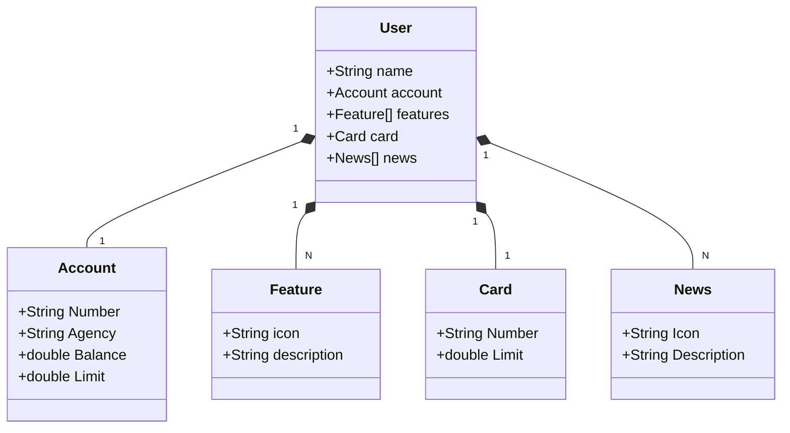

# Bootcamp Bradesco - Java Cloud Native 2025
Java RESTful API criada para o Bootcamp Bradesco - Java Cloud Native 2025

## Diagrama de Classes

```mermaid
classDiagram
    class User {
        +String name
        +Account account
        +Feature[] features
        +Card card
        +News[] news
    }

    class Account {
        +String Number
        +String Agency
        +double Balance
        +double Limit
    }

    class Feature {
        +String icon
        +String description
    }

    class Card {
        +String Number
        +double Limit
    }

    class News {
        +String Icon
        +String Description
    }

    User "1" *-- "1" Account
    User "1" *-- "N" Feature
    User "1" *-- "1" Card
    User "1" *-- "N" News
```
